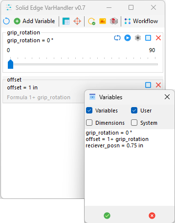
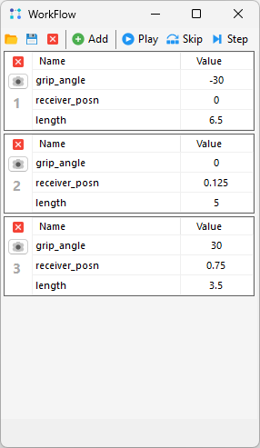
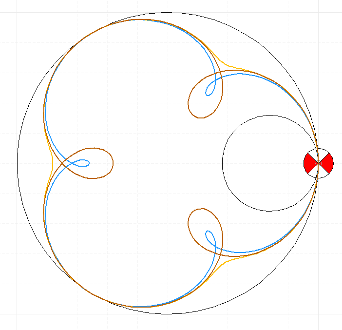

# SolidEdge-VarHandler

Francesco Arfilli 2025

Solid Edge VarHandler helps you do engineering analysis on moving parts and assemblies.  You can create scripted animations, trace out keypoint paths in 2D or 3D, check interference through a range of motion, and more.

It works by stepping through values you define on variables you select.  The variables can be processed sequentially or in parallel, or a combination of both.

**Setup**

To get started, open the file in Solid Edge.  Then, prepare your analysis using the following steps and options.  

-   *Reset*.  Clears the list and reloads variables that have Autotune enabled (see below).

-   *Add*.  Opens the Select Variables dialog.  You can choose variables and/or dimensions, either created by the user and/or by the system.  Once selected, variables are presented in a panel for checking/editing.  (For read-only variables, editing is disabled).

  - *Range*.  Set the desired range by editing the numbers on the track bar.

  -   *Loop*.  Cycle continuously from low to high and back. 

  -   *Play*.  Click to move to the end of the range.  Click again to move back.

  -   *Settings*.  Set the number of steps between low and high.

  -   *Autotune*.  Enable this option to save range information to the file.

  -   *Remove*.  Delete the variable from the form.

  - *Expose name*.  Change the variable's expose name by double-clicking the name at the top of the panel.

  - *Current value*.  Change the variable's current value by dragging the task bar indicator, or editing the value in the displayed formula.

-   *Export*.  Saves the results to excel for plotting or further analysis.

-   *Track*.  Enables key point tracing.  For model files, key points are defined with a Coordinate System.  For drawings, they are defined with a Block.  In either case, the item must be named "Tracker".

  -   *Trace*.  Records the keypoint motion path with a spline curve.

  - *Closed curve*.  Enable this option to create a closed trace curve.

  -   *Settings*.  Set the number of decimal points to use in the report.

  -   *Remove*.  Delete the tracker.

-   *Update*.  Runs the Update Document command after each step.  This is necessary to visualize  changes that occur beneath the top level of the file. 

-   *Save Images*.  Saves an image at each step.

-   *Check Interference*.  Runs the Check Interference command at each step.

-   *Workflow*.  Opens the Workflow panel (see next).

**WorkFlow**

A workflow is a sequence of "events".  Each event changes each variable from its start value to its end value in a certain number of steps.  

The variables are those added during setup.  The start value is from the previous step, or from initialization.  The end value is set in the event panel.  (If the start and end are the same, which is common, no change occurs).  The steps parameter sets the number of analysis points for the event.

At each step in each event, any analysis you set up (trace, check interference, etc.) will be performed.

The workflow controls are detailed below.

-  *Open*.  Loads a saved workflow. 
-  *Save*.  Saves the current workflow to disk.
-  *Close*.  Closes the current workflow.
-  *Add Event*.  Adds an event to the current workflow.
-  *Play*.  Runs the events from beginning to end.
-   *Settings*.  Set the number of steps for the event.

Example video [<ins>here</ins>](https://youtu.be/JcF9NA-WjCA).

**Releases**

All released versions [<ins>here</ins>](https://github.com/farfilli/SolidEdge-VarHandler/releases).

**Release notes**

- 0.1 Very initial and rude one

- 0.2 Better error handling, variable selector and stay on top

- 0.3 Decimal support for initial value, Play button, Loop button, Stay on top, Manual value edit

- 0.4 Support for System and User Variable and Dimensions, export results to excel, settings button

- 0.5 Correctly handled the range values, enabled 2D\3D tracker

- 0.6 Multiple variable selection, tracker widget, and ability to trace the tracker with a spline curve

- 0.7 Update document option, Workflows
  
**Known limits**
- ~~Only user variables supported~~
- Supported units are `mm`, `in`, `degree`, `second`, and `scalar`.  Other units will result in a warning.

**Example videos**
- Video in action [<ins>here</ins>](https://www.youtube.com/watch?v=krcpQPdgGos&t=3s&ab_channel=FrancescoArfilli).
- If you liked that last one as much as I did, you can see it again [<ins>here</ins>](https://www.youtube.com/watch?v=krcpQPdgGos&t=3s&ab_channel=FrancescoArfilli).
- 2D Tracker tracing a spline [<ins>here</ins>](https://www.youtube.com/watch?v=YH6zwButRlo&ab_channel=FrancescoArfilli).
- 3D Tracker in assembly [<ins>here</ins>](https://youtu.be/T-k3u4ftC2k?si=VSHl7Id2dQuqqkK0).

**Example files**

The following links open in GitHub.  To download, click the download button as shown.

- Example file of the 2D tracker [<ins>here</ins>](./2DVarHandler.zip).
- An example assembly is provided [<ins>here</ins>](./Crane.zip).
- An example interference check is provided [<ins>here</ins>](./Examples/interference.zip).
- An example motor sizing calculation is provided [<ins>here</ins>](./Examples/motor_sizing.zip).

**Example images**

2D Trace

Assembly

Populated variable table

Exported results in excel after processing

